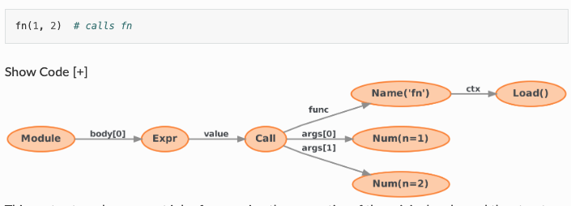
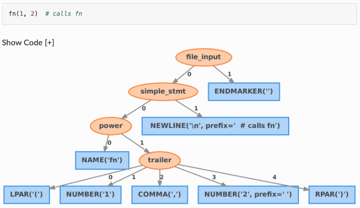
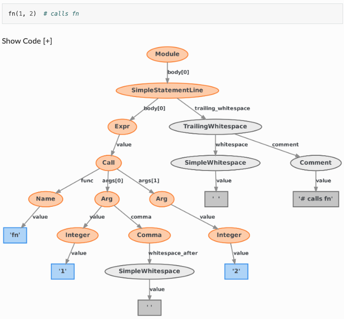

<!-- _class: title -->

# Fixit Linter + AI Coding

## Python Code Quality Strategy for the AI Era

Python Asia 2026

---

<!-- _class: intro -->

# About Me

<div style="display:grid;grid-template-columns:1fr 300px;gap:2rem;align-items:center;flex:1;margin-top:1.5rem;padding-right:3rem">
  <div>
    <ul>
      <li><strong>Name</strong>: Hidé (Naohide Anahara)</li>
      <li><strong>GitHub</strong>: github.com/naohide</li>
      <li>Python Developer</li>
      <li>Working at Tokyo Gas Co., Ltd.
</li>
    </ul>
  </div>
  <div>
    
  </div>
</div>

---

<!-- _class: toc -->

# Agenda

<div class="toc-list">
  <div class="toc-item">
    <span class="toc-number">Part 1</span>
    <span class="toc-title">Fixit Linter <b>due to</b> AI Coding</span>
  </div>
  <div class="toc-item">
    <span class="toc-number">01</span>
    <span class="toc-title">Background & Challenges - Why Custom Linters Are Needed</span>
  </div>
  <div class="toc-item">
    <span class="toc-number">02</span>
    <span class="toc-title">What Is Fixit - A libcst-Based Lint Framework</span>
  </div>
  <div class="toc-item">
    <span class="toc-number">03</span>
    <span class="toc-title">AST vs CST - Why CST Matters</span>
  </div>
  <div class="toc-item">
    <span class="toc-number">04</span>
    <span class="toc-title">AI-Powered Rule Generation</span>
  </div>
  <div class="toc-item">
    <span class="toc-number">05</span>
    <span class="toc-title">Practice - Automating logging to structlog Migration</span>
  </div>
</div>

---

<!-- _class: toc -->

# Agenda (cont.)

<div class="toc-list">
  <div class="toc-item">
    <span class="toc-number">Part 2</span>
    <span class="toc-title">Fixit Linter <b>for</b> AI Coding</span>
  </div>
  <div class="toc-item">
    <span class="toc-number">06</span>
    <span class="toc-title">Quality Challenges of AI-Generated Code</span>
  </div>
  <div class="toc-item">
    <span class="toc-number">07</span>
    <span class="toc-title">Guarding AI Code Quality with Fixit</span>
  </div>
  <div class="toc-item">
    <span class="toc-number">08</span>
    <span class="toc-title">mutmut - Verifying Test Quality with Mutation Testing</span>
  </div>
  <div class="toc-item">
    <span class="toc-number">09</span>
    <span class="toc-title">CI/CD Integration & Operations</span>
  </div>
</div>

---

<!-- _class: section-start -->

# Part 1: Fixit Linter due to AI Coding

## Custom Linters Matter More Than Ever in the AI Era

---

<!-- _class: section-start -->

# 01. Background & Challenges

## Why Do We Need Custom Linters?

---

<!-- _class: rhetorical -->

# How does your team
# enforce coding
# standards?

---

<!-- _class: two-col-contrast -->

# The Reality of Code Reviews

<div class="grid">
  <div class="col-left">
    <h2>Common Problems</h2>
    <ul>
      <li>Team-specific conventions become tacit knowledge</li>
      <li>Review quality depends on individual reviewers</li>
      <li>Review feedback tends to be subjective</li>
      <li>Slow onboarding of new members to conventions</li>
    </ul>
  </div>
  <div class="col-right">
    <h2>The Ideal State</h2>
    <ul>
      <li>Coding standards are explicitly documented</li>
      <li>Conventions are verified mechanically</li>
      <li>Objective and consistent feedback</li>
      <li>Automatically enforced via CI/CD</li>
    </ul>
  </div>
</div>

---

# A Common Scenario in Practice

```python
# During a PR review...

# Reviewer A: "Please use structlog instead of logging"
import logging
logger = logging.getLogger(__name__)

# Reviewer B: "Oh, I didn't know about that..."
# Reviewer C: "This wasn't flagged in the last PR..."
```

**The same feedback repeated over and over = an opportunity for automation**

---

<!-- _class: three-col -->

# 3 Problems Custom Linters Solve

<div class="grid">
  <div class="col">
    <div class="col-icon">1</div>
    <h3>Eliminating Subjectivity</h3>
    <p>Define coding conventions as machine-enforceable rules to prevent reviewer-dependent reviews</p>
    
  </div>
  <div class="col">
    <div class="col-icon">2</div>
    <h3>Enforcing Best Practices</h3>
    <p>Automatically apply the organization's "ideal patterns" across the entire codebase</p>
    
  </div>
  <div class="col">
    <div class="col-icon">3</div>
    <h3>From Human to Machine</h3>
    <p>Shift from human-dependent review processes to automated machine verification</p>
    
  </div>
</div>

---

# Limitations of General-Purpose Linters

**ruff, flake8, pylint** are excellent, but...

- They only provide generic rules
- Cannot address organization-specific requirements

**Examples of rules you need:**
- Enforcing <span style="color:#e74c3c">logging → structlog</span> migration
- Prohibiting direct use of <span style="color:#e74c3c">datetime.now()</span> (for testability)
- Requiring internal HTTP client instead of <span style="color:#e74c3c">requests</span>
- Detecting deprecated internal APIs

**Custom rules are essential to enforce organization-specific coding standards**

---

<!-- _class: section-start -->

# 02. What Is Fixit

## A Python Lint Framework Born at Instagram

---

<!-- _class: panel -->

# Fixit Overview

<div class="panel-container">
  <div class="panel-header">
    <div class="panel-icon">🔧</div>
    <h2>Instagram/Fixit</h2>
  </div>
  <p>A powerful Python lint framework based on <strong>libcst</strong>. Easy to create custom rules with built-in autofix capabilities.</p>
  <ul>
    <li>Precise syntax analysis using <strong>libcst</strong> (CST = Concrete Syntax Tree)</li>
    <li>Place custom rules directly in your repository</li>
    <li>Interactive review or bulk autofix of suggested fixes</li>
    <li>Hierarchical configuration management (project/directory/file level)</li>
  </ul>
</div>

---

# Key Features & Basic Usage

<div style="display:grid;grid-template-columns:1fr 1fr;gap:2rem;margin-top:1rem">
  <div>
    <h3>Main Features</h3>
    <ul>
      <li><strong>Lint</strong>: Detect rule violations</li>
      <li><strong>Fix</strong>: Automatically fix issues</li>
      <li><strong>Local Rules</strong>: Place in your repository</li>
      <li><strong>Hierarchical Config</strong>: Per-directory settings</li>
    </ul>
  </div>
  <div>
    <h3>Basic Commands</h3>
    <pre style="font-size:1em;background:#eeeeee;padding:1em;border-radius:8px"><code># Install
$ pip install fixit
$ fixit lint path/to/code.py
$ fixit fix path/to/code.py
$ fixit fix --interactive path/
</code></pre>
  </div>
</div>

---

# Basic Structure of a Fixit Rule

```python
import libcst as cst
import fixit

class MyRule(fixit.LintRule):
    """Description of the rule"""
    MESSAGE = "Description of the issue"

    def visit_Call(self, node: cst.Call) -> None:
        """Visit specific nodes for inspection"""
        # Inspect node and report violation
        self.report(node, message="Fix required")

    def visit_Import(self, node: cst.Import) -> None:
        """Inspect import statements"""
        # Specifying replacement enables autofix
        self.report(node, replacement=new_node)
```

**Visitor Pattern**: Traverses each node in the tree for inspection

---

# Fixit Configuration File

```toml
# .fixit.toml - Place in the project root

[fixit]
# Custom rules directory
local = ["lint_rules/"]

# Rules to enable
enable = ["fixit.rules", "lint_rules"]

# Rules to disable
disable = ["fixit.rules:CompareSingletonPrimitivesByIs"]

# Python version
python-version = "3.14"
```

Place a separate `.fixit.toml` in subdirectories for **hierarchical configuration**

---

<!-- _class: section-start -->

# 03. AST vs CST

## Why the Concrete Syntax Tree Matters

---

<!-- _class: center-message -->

# Two Approaches to
# "Understanding" Source Code

AST (Abstract Syntax Tree) vs CST (Concrete Syntax Tree)

---

<!-- _class: two-col-compare -->

# AST vs CST: The Difference

<div class="grid">
  <div class="col-before">
    <h2>AST (Abstract Syntax Tree)</h2>
    <ul>
      <li>Retains only structural information</li>
      <li>Comments are lost</li>
      <li>Whitespace and newlines are lost</li>
      <li>Formatting is lost</li>
    </ul>
  </div>
  <div class="col-after">
    <h2>CST (Concrete Syntax Tree)</h2>
    <ul>
      <li>Retains structure + formatting info</li>
      <li>Comments are preserved</li>
      <li>Whitespace and newlines are preserved</li>
      <li>Original formatting is maintained</li>
    </ul>
  </div>
</div>

---

# AST Basics



**AST extracts only the "meaning" of code and discards the "appearance"**

---

# The AST Problem: Information Lost During Transformation

```python
# Original code
import logging  # Legacy logging

# Initialize logger for this module
logger = logging.getLogger(__name__)
```

**When transformed with AST...**

```python
import structlog
logger = structlog.get_logger()
```

Comments are lost, along with the team's notes and intentions

---

# CST Basics



**CST represents code in a "fully recoverable form"**

However, lib2to3 was removed in Python 3.13 → a successor is needed

---

# Enter LibCST

A CST library from Meta (Instagram) that solves the issues of lib2to3

- **LibCST's Improvement**: Combines CST completeness with AST-like semantic usability
- Code transformation framework based on the Visitor pattern
- Safe immutable node operations via `with_changes()`
- Used as the foundational library for Fixit



---

# Clean git diffs

```diff
# CST-based transformation keeps diffs minimal
- import logging
+ import structlog

# Application's main logger   ← Comment preserved
- logger = logging.getLogger(__name__)
+ logger = structlog.get_logger()
```

**Only the changed parts appear in the diff = easier reviews**

With AST-based approaches, entire files get rewritten, leading to massive diffs

---

<!-- _class: section-start -->

# 04. AI-Powered Rule Generation

## Generating Custom Linter Rules from Natural Language

---

<!-- _class: rhetorical -->

# Writing Fixit rules
# is surprisingly
# challenging

Requires understanding libcst's Visitor pattern and CST node structure

---

# The Traditional Barrier to Rule Creation

```python
# You need to understand libcst's node structure
cst.Import(
    names=[
        cst.ImportAlias(
            name=cst.Attribute(
                value=cst.Name("logging"),
                attr=cst.Name("getLogger"),
            ),
        ),
    ],
)
```

- Deep knowledge of CST node types and hierarchy is required
- Understanding `visit_*` / `leave_*` method usage in the Visitor pattern
- Writing safe node modifications with `with_changes()`
- **→ High learning curve, can't write rules right away**

---

<!-- _class: steps -->

# AI-Powered Rule Generation Flow

<div class="step-list">
  <div class="step">
    <div class="step-number">1</div>
    <div class="step-content">
      <h3>Describe in Natural Language</h3>
      <p>"Replace logging.getLogger usage with structlog.get_logger"</p>
    </div>
  </div>
  <div class="step">
    <div class="step-number">2</div>
    <div class="step-content">
      <h3>AI Generates the Fixit Rule</h3>
      <p>Automatically generates a LintRule class based on libcst's Visitor pattern</p>
    </div>
  </div>
  <div class="step">
    <div class="step-number">3</div>
    <div class="step-content">
      <h3>Apply Across the Entire Codebase</h3>
      <p>Bulk autofix with the fixit fix command</p>
    </div>
  </div>
</div>

---

<!-- _class: panel-gradient -->

# AI Lowers the Barrier

<div class="panel-container">
  <h2>An era where anyone can create custom linters</h2>
  <p>Even without deep knowledge of libcst, simply describing what you want in natural language automatically generates Fixit rules.<br>This enables the entire team to participate in defining and enforcing coding standards.</p>
</div>

---

<!-- _class: section-start -->

# 05. Practice

## Automating the logging → structlog Migration

---

<!-- _class: panel-glass -->

# Why structlog?

<div class="panel-container">
  <h2>Industry Trend Toward Structured Logging</h2>
  <p>Python's standard logging module is flexible but cumbersome for structured log output.</p>
  <p>structlog enables concise key-value format logging with excellent compatibility with JSON output and log pipelines. </p>
  <p>Many organizations are making the switch.</p>
</div>

---

# The Transformation Goal

**Before:**
```python
import logging

logger = logging.getLogger(__name__)
logger.info("User logged in", extra={"user_id": user_id})
```

**After:**
```python
import structlog

logger = structlog.get_logger()
logger.info("User logged in", user_id=user_id)
```

We want to automatically handle **both** the import change and the function call change

---

# Example Prompt for AI

```text
Please generate the following Fixit rule:

1. Transform import logging to import structlog
2. Transform logging.getLogger(__name__) to structlog.get_logger()
3. Preserve existing comments and formatting

The rule should inherit from fixit.LintRule,
detect using visit_ImportFrom / visit_Call methods,
and implement autofix.
```

---

# AI-Generated Fixit Rule (1/3): Class Definition

```python
import libcst as cst
from libcst import matchers as m
import fixit

class ReplaceLoggingWithStructlog(fixit.LintRule):
    """Rule to replace logging module usage with structlog"""

    MESSAGE = "Use structlog instead of logging"
    TAGS = {"migration", "logging"}
```

Simple class definition and metadata declaration

---

# AI-Generated Fixit Rule (2/3): Import Detection

```python
    def visit_Import(self, node: cst.Import) -> None:
        """Detect import logging and transform to import structlog"""
        if isinstance(node.names, (list, tuple)):
            for i, alias in enumerate(node.names):
                if isinstance(alias.name, cst.Name) \
                   and alias.name.value == "logging":
                    new_names = list(node.names)
                    new_names[i] = alias.with_changes(
                        name=cst.Name("structlog")
                    )
                    new_node = node.with_changes(
                        names=new_names
                    )
                    self.report(node, replacement=new_node)
```

`with_changes()` replaces the node while preserving comments and whitespace

---

# AI-Generated Fixit Rule (3/3): Function Call Detection

```python
    def visit_Call(self, node: cst.Call) -> None:
        """Detect logging.getLogger(__name__)"""
        if self._is_logging_get_logger(node):
            new_node = cst.Call(
                func=cst.Attribute(
                    value=cst.Name("structlog"),
                    attr=cst.Name("get_logger"),
                ),
                args=[],  # No arguments needed for structlog
            )
            self.report(node, replacement=new_node)

    def _is_logging_get_logger(self, node: cst.Call) -> bool:
        return (
            isinstance(node.func, cst.Attribute)
            and isinstance(node.func.value, cst.Name)
            and node.func.value.value == "logging"
            and node.func.attr.value == "getLogger"
        )
```

---

# Testing the Rule

```python
# tests/test_replace_logging.py
from fixit import LintRuleTest

class TestReplaceLogging(LintRuleTest):
    RULE = ReplaceLoggingWithStructlog

    VALID = [
        # Correct code using structlog
        "import structlog\nlogger = structlog.get_logger()",
    ]

    INVALID = [
        # Violating code using logging
        "import logging\nlogger = logging.getLogger(__name__)",
    ]
```

**Fixit includes a built-in test framework** → ensuring rule quality

---

<!-- _class: compare-conclude -->

# Traditional Approach vs Fixit + AI

<div class="comparison">
  <div class="compare-col">
    <h3>Traditional Approach</h3>
    <ul>
      <li>Manually search and replace across all files</li>
      <li>Regex struggles with complex patterns</li>
      <li>Risk of breaking comments and formatting</li>
      <li>Requires expert knowledge to create rules</li>
    </ul>
  </div>
  <div class="compare-col">
    <h3>Fixit + AI</h3>
    <ul>
      <li>Safe automatic transformation with CST</li>
      <li>Accurately detects complex syntax patterns</li>
      <li>Fully preserves comments and formatting</li>
      <li>Generate rules from natural language</li>
    </ul>
  </div>
</div>

<div class="conclusion">
  <p>AI + CST enables "safe," "fast," and "anyone can create" custom linters</p>
</div>

---

<!-- _class: section-start -->

# Part 2: Fixit Linter for AI Coding

## How to Safeguard the Quality of AI-Generated Code

---

<!-- _class: section-start -->

# 06. Quality Challenges of AI-Generated Code

## New Risks in the AI Coding Era

---

<!-- _class: rhetorical -->

# How much do you
# trust the code
# written by AI?

---

<!-- _class: two-col-contrast -->

# The Light and Shadow of AI Coding

<div class="grid">
  <div class="col-left">
    <h2>Benefits of AI Coding</h2>
    <ul>
      <li>Dramatic improvement in code generation speed</li>
      <li>Automatic boilerplate generation</li>
      <li>Instant use of unfamiliar libraries</li>
      <li>Code generation from natural language</li>
    </ul>
  </div>
  <div class="col-right">
    <h2>Often Overlooked Risks</h2>
    <ul>
      <li>Code unaware of organizational conventions</li>
      <li>Introduction of deprecated patterns</li>
      <li>Tests that "just pass" without real quality</li>
      <li>Security concerns</li>
    </ul>
  </div>
</div>

---

# Problematic Code AI Tends to Generate

```python
# AI generates working code, but doesn't know your org's conventions

import logging                    # ← Should use structlog
import requests                   # ← Should use internal HTTP client
from datetime import datetime

logger = logging.getLogger(__name__)

def get_user(user_id: str):
    response = requests.get(f"/api/users/{user_id}")
    created_at = datetime.now()   # ← Testability issue
    logger.info(f"Fetched user {user_id}")  # ← Should use structured logging
    return response.json()
```

**It works, but doesn't meet the team's standards**

---

<!-- _class: panel-emphasis -->

# Why Custom Linters Matter in the AI Era

<div class="panel-container">
  <h2>AI generates code. Linters correct code.</h2>
  <p>As the volume of AI-generated code increases, <span class="highlight">automated enforcement of organization-specific quality standards</span> becomes essential.</p>
  <p>Fixit's custom rules can be <span class="highlight">freely customized to match each organization's or team's standards</span>,
  enabling <span class="highlight">instant feedback on AI-generated code, just like a human reviewer</span>.</p>
</div>

---

<!-- _class: section-start -->

# 07. Guarding AI Code Quality with Fixit

## Applying Custom Rules to Generated Code

---

<!-- _class: steps -->

# AI Coding + Fixit Workflow

<div class="step-list">
  <div class="step">
    <div class="step-number">1</div>
    <div class="step-content">
      <h3>AI Generates Code</h3>
      <p>Generate code with Copilot / ChatGPT / Claude, etc.</p>
    </div>
  </div>
  <div class="step">
    <div class="step-number">2</div>
    <div class="step-content">
      <h3>Fixit Checks Instantly</h3>
      <p>Custom rules automatically detect violations of organizational standards</p>
    </div>
  </div>
  <div class="step">
    <div class="step-number">3</div>
    <div class="step-content">
      <h3>Autofix or Notify Developer</h3>
      <p>Autofix with fixit fix, or block the PR in CI</p>
    </div>
  </div>
</div>

---

# Applying Fixit to AI-Generated Code

```bash
# Check AI-generated code with fixit
$ fixit lint src/ai_generated/

src/ai_generated/user_service.py:1:1 ReplaceLoggingWithStructlog
  Use structlog instead of logging
src/ai_generated/user_service.py:8:5 BanDatetimeNow
  Direct use of datetime.now() is prohibited
src/ai_generated/user_service.py:3:1 BanRequestsLibrary
  Use internal HTTP client instead of requests

Found 3 violations in 1 file.

# Bulk autofix
$ fixit fix src/ai_generated/
Fixed 1 file.
```

**Automatically correct AI-generated output to meet team standards**

---

<!-- _class: section-start -->

# 08. mutmut

## Strengthening Fixit Rule Test Cases

---

<!-- _class: panel -->

# What Is mutmut

<div class="panel-container">
  <div class="panel-header">
    <div class="panel-icon">🧬</div>
    <h2>mutmut - Python Mutation Testing</h2>
  </div>
  <p>A tool that introduces intentional small changes (mutants) to code and verifies whether tests can detect them. It measures the "true quality" of your tests.</p>
  <ul>
    <li>Measures <strong>test detection capability</strong> that code coverage alone cannot reveal</li>
    <li>Fast mutation verification through parallel execution</li>
    <li>Interactive UI to browse mutant results</li>
    <li>Incremental execution (resume from where you left off)</li>
  </ul>
</div>

---

<!-- _class: center-message -->

# Are the VALID / INVALID cases
# in your Fixit rules really enough?

Mutation testing reveals gaps in your test cases

---

# A Quick Review of Fixit Rule Testing

```python
class TestReplaceLogging(LintRuleTest):
    RULE = ReplaceLoggingWithStructlog

    VALID = [
        "import structlog",                          # Correct import
    ]

    INVALID = [
        "import logging",                            # Violating import
    ]
```

**Looks sufficient at first glance, but... what about these cases?**

- What about `from logging import getLogger`?
- What about `import logging as log`?
- What about `import logging, os`?

---

<!-- _class: two-col-compare -->

# Coverage vs Mutation Testing

<div class="grid">
  <div class="col-before">
    <h2>Code Coverage</h2>
    <ul>
      <li>Measures "lines executed by tests"</li>
      <li>Can reach 100% by just executing lines</li>
      <li>VALID/INVALID completeness is unknown</li>
      <li>Cannot detect missing rule conditions</li>
    </ul>
  </div>
  <div class="col-after">
    <h2>Mutation Testing</h2>
    <ul>
      <li>Mutates the rule's code for verification</li>
      <li>Checks if VALID/INVALID can detect mutations</li>
      <li>Discovers missing test cases</li>
      <li>Reveals the true robustness of rules</li>
    </ul>
  </div>
</div>

---

# What mutmut Does to Fixit Rules

```python
# Original rule
def _is_logging_get_logger(self, node):
    return (
        isinstance(node.func, cst.Attribute)
        and node.func.value.value == "logging"     # ← Mutated here
        and node.func.attr.value == "getLogger"    # ← Mutated here too
    )
```

**Mutants generated by mutmut:**

```python
# Mutant 1: Change the string
and node.func.value.value == "XXloggingXX"   # "logging" changed

# Mutant 2: Remove the condition
and True                                      # Condition always True

# Mutant 3: Change and to or
or node.func.attr.value == "getLogger"        # and → or
```

**If VALID/INVALID can't detect these mutations, test cases are insufficient**

---

# How to Use mutmut

```bash
# Run mutation testing on Fixit rules
$ mutmut run --paths-to-mutate=lint_rules/

# Check results
$ mutmut results
Survived 🙁: 3    ← Mutations not detected by VALID/INVALID
Killed ✓:   12   ← Correctly detected mutations
Total:      15
Mutation score: 80%

# View details of survived mutants
$ mutmut browse
```

**Survived = test cases missing from VALID/INVALID**

---

# Adding Test Cases from Survived Mutants

```python
# mutmut found: "from logging import ..." not detected
# → Add cases to INVALID

class TestReplaceLogging(LintRuleTest):
    RULE = ReplaceLoggingWithStructlog

    VALID = [
        "import structlog",
        "from structlog import get_logger",       # ✅ Added
        "import logging_utils",                   # ✅ Added: similar name allowed
    ]

    INVALID = [
        "import logging",
        "from logging import getLogger",          # ✅ Added
        "import logging as log",                  # ✅ Added
        "import os, logging",                     # ✅ Added
    ]
```

**mutmut Survived → add test cases → improve rule robustness**

---

<!-- _class: steps -->

# Fixit Rule Strengthening Flow with mutmut

<div class="step-list">
  <div class="step">
    <div class="step-number">1</div>
    <div class="step-content">
      <h3>AI Generates Fixit Rule + VALID/INVALID</h3>
      <p>Auto-generate basic rules and test cases from natural language</p>
    </div>
  </div>
  <div class="step">
    <div class="step-number">2</div>
    <div class="step-content">
      <h3>mutmut Mutation-Tests the Rule Code</h3>
      <p>Detect which parts of the rule implementation aren't covered by VALID/INVALID</p>
    </div>
  </div>
  <div class="step">
    <div class="step-number">3</div>
    <div class="step-content">
      <h3>Strengthen VALID/INVALID from Survived Mutants</h3>
      <p>Add missing edge cases to tests, ensuring rule quality</p>
    </div>
  </div>
</div>

---

<!-- _class: section-start -->

# 09. CI/CD Integration & Operations

## How to Adopt Across Your Team

---

# Integrating into the CI/CD Pipeline

```yaml
# .github/workflows/quality.yml
name: AI Code Quality Gate
on: [pull_request]

jobs:
  fixit:
    runs-on: ubuntu-latest
    steps:
      - uses: actions/checkout@v4
      - uses: actions/setup-python@v5
      - run: pip install fixit mutmut
      - run: fixit lint src/                # Code quality check
      - run: mutmut run --CI                # Test quality check
```

**Automatically verify code quality + test quality on every PR**

---

<!-- _class: summary-glass -->

# Summary

<div class="summary-items">
  <div class="summary-item">
    <div class="summary-number">1</div>
    <div class="summary-text">Generate custom linter rules from natural language with AI and apply across the entire codebase</div>
  </div>
  <div class="summary-item">
    <div class="summary-number">2</div>
    <div class="summary-text">Guard AI-generated code quality with Fixit, and test quality with mutmut</div>
  </div>
  <div class="summary-item">
    <div class="summary-number">3</div>
    <div class="summary-text">Safe automatic transformation with Fixit + LibCST, fully preserving formatting and comments</div>
  </div>
  <div class="summary-item">
    <div class="summary-number">4</div>
    <div class="summary-text">Integrate into CI/CD to continuously and automatically safeguard code quality in the AI Coding era</div>
  </div>
</div>

---

<!-- _class: closing -->

# Thank You!

Automatically safeguard your team's
code quality with Fixit + AI

<div class="contact">
GitHub: github.com/naohide
</div>

<div class="contact">
LinkedIn: linkedin.com/in/naohide
</div>
