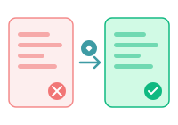
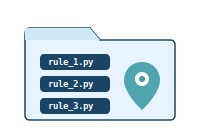
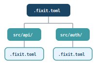

<!-- _class: title -->

# Fixit Linter + AI Coding

## AI時代のPythonコード品質戦略

Python Asia 2026

---

<!-- _class: intro -->

# About Me

<div style="display:grid;grid-template-columns:1fr 300px;gap:2rem;align-items:center;flex:1;margin-top:1.5rem;padding-right:3rem">
  <div>
    <ul>
      <li><strong>Name</strong>: Naohide Anahara</li>
      <li><strong>GitHub</strong>: github.com/naohide</li>
      <li>Python Developer</li>
      <li>Working at Tokyo Gas Co., Ltd.
</li>
    </ul>
  </div>
  <div>
    
  </div>
</div>

---

<!-- _class: toc -->

# Agenda

<div class="toc-list">
  <div class="toc-item">
    <span class="toc-number">Part 1</span>
    <span class="toc-title">Fixit Linter due to AI Coding</span>
  </div>
  <div class="toc-item">
    <span class="toc-number">01</span>
    <span class="toc-title">背景と課題 - なぜカスタムLinterが必要か</span>
  </div>
  <div class="toc-item">
    <span class="toc-number">02</span>
    <span class="toc-title">Fixit とは - libcst ベースのLintフレームワーク</span>
  </div>
  <div class="toc-item">
    <span class="toc-number">03</span>
    <span class="toc-title">AST vs CST - なぜ CST が重要か</span>
  </div>
  <div class="toc-item">
    <span class="toc-number">04</span>
    <span class="toc-title">AI によるルール自動生成</span>
  </div>
  <div class="toc-item">
    <span class="toc-number">05</span>
    <span class="toc-title">実践デモ - logging から structlog への移行</span>
  </div>
</div>

---

<!-- _class: toc -->

# Agenda (cont.)

<div class="toc-list">
  <div class="toc-item">
    <span class="toc-number">Part 2</span>
    <span class="toc-title">Fixit Linter for AI Coding</span>
  </div>
  <div class="toc-item">
    <span class="toc-number">06</span>
    <span class="toc-title">AI が書くコードの品質課題</span>
  </div>
  <div class="toc-item">
    <span class="toc-number">07</span>
    <span class="toc-title">Fixit による AI コードの品質ガード</span>
  </div>
  <div class="toc-item">
    <span class="toc-number">08</span>
    <span class="toc-title">mutmut - ミューテーションテストでテスト品質を検証</span>
  </div>
  <div class="toc-item">
    <span class="toc-number">09</span>
    <span class="toc-title">CI/CD 統合と運用</span>
  </div>
</div>

---

<!-- _class: section-start -->

# Part 1: Fixit Linter due to AI Coding

## AI時代だからこそカスタムLinterが重要

---

<!-- _class: section-start -->

# 01. 背景と課題

## なぜカスタムLinterが必要なのか

---

<!-- _class: rhetorical -->

# あなたのチームでは
# コーディング規約を
# どうやって守っていますか？

---

<!-- _class: two-col-contrast -->

# コードレビューの現状

<div class="grid">
  <div class="col-left">
    <h2>よくある問題</h2>
    <ul>
      <li>チーム固有の規約が暗黙知化</li>
      <li>レビュー品質がレビュアーに依存</li>
      <li>レビュー指摘が主観的になりがち</li>
      <li>新メンバーへの規約浸透が遅い</li>
    </ul>
  </div>
  <div class="col-right">
    <h2>理想の姿</h2>
    <ul>
      <li>コーディング基準が明文化されている</li>
      <li>規約が機械的に検証される</li>
      <li>客観的で一貫したフィードバック</li>
      <li>CI/CDで自動的に強制できる</li>
    </ul>
  </div>
</div>

---

# 現場でよく起こるシナリオ

```python
# PR レビューにて...

# レビュアーA: 「logging じゃなくて structlog 使ってください」
import logging
logger = logging.getLogger(__name__)

# レビュアーB: 「あ、それ知りませんでした...」
# レビュアーC: 「前のPRでは指摘されなかったのですが...」
```

**同じ指摘が何度も繰り返される = 自動化のチャンス**

---

<!-- _class: three-col -->

# カスタムLinterが解決する3つの課題

<div class="grid">
  <div class="col">
    <div class="col-icon">1</div>
    <h3>主観性の排除</h3>
    <p>コーディング規約を機械的ルールとして定義し、レビューの属人化を防ぐ</p>
    
  </div>
  <div class="col">
    <div class="col-icon">2</div>
    <h3>理想パターンの強制</h3>
    <p>組織が定義した「あるべき姿」を自動的にコードベース全体に適用</p>
    
  </div>
  <div class="col">
    <div class="col-icon">3</div>
    <h3>人→機械への移行</h3>
    <p>人間依存のレビュープロセスから、機械検証による自動化へシフト</p>
    
  </div>
</div>

---

# 汎用Linterの限界


**ruff, flake8, pylint** などの汎用Linterは優秀だが...

- 一般的なルールのみ提供
- 組織固有の要件には対応不可
- 例: 「loggingモジュールではなくstructlogを使うこと」
- 例: 「特定のデコレータを必ず付けること」
- 例: 「非推奨APIの使用を禁止すること」

**組織のコーディング規約を強制するには カスタムルールが不可欠**

---

<!-- _class: panel-emphasis -->

# 組織固有ルールの具体例

<div class="panel-container">
  <h2>汎用Linterでは検出できないルール</h2>
  <p>
    <span class="highlight">logging → structlog</span> の統一<br>
    <span class="highlight">datetime.now()</span> の直接使用禁止（テスタビリティ確保）<br>
    <span class="highlight">requests</span> ではなく社内HTTPクライアントの使用<br>
    特定の例外クラスを継承しないカスタム例外の禁止<br>
    非推奨の内部APIを呼び出しているコードの検出
  </p>
</div>

---

<!-- _class: section-start -->

# 02. Fixit とは

## Instagram発のPython Lintフレームワーク

---

<!-- _class: panel -->

# Fixit の概要

<div class="panel-container">
  <div class="panel-header">
    <div class="panel-icon">🔧</div>
    <h2>Instagram/Fixit</h2>
  </div>
  <p><strong>libcst</strong> ベースの高機能Python Lintフレームワーク。カスタムルールの作成が容易で、自動修正（autofix）機能を標準搭載。</p>
  <ul>
    <li><strong>libcst</strong> による正確な構文解析（CST = Concrete Syntax Tree）</li>
    <li>リポジトリ内にカスタムルールを配置可能</li>
    <li>修正提案の対話的な確認 or 一括自動適用</li>
    <li>階層的な設定管理（プロジェクト/ディレクトリ/ファイル単位）</li>
  </ul>
</div>

---

<!-- _class: four-col -->

# Fixit の主要機能

<div class="grid">
  <div class="col">
    <div class="col-number">Lint</div>
    <h3>検出</h3>
    <p>ルール違反を検出して報告</p>
    
  </div>
  <div class="col">
    <div class="col-number">Fix</div>
    <h3>自動修正</h3>
    <p>検出箇所を自動で修正</p>
    
  </div>
  <div class="col">
    <div class="col-number">Local</div>
    <h3>ローカルルール</h3>
    <p>リポジトリ内にルール配置</p>
    
  </div>
  <div class="col">
    <div class="col-number">Config</div>
    <h3>階層設定</h3>
    <p>ディレクトリ毎に設定可能</p>
    
  </div>
</div>

---

# Fixit の基本的な使い方

```python
# .fixit.toml で設定
[fixit]
local = ["lint_rules/"]    # カスタムルールの配置先

# コマンド実行
$ pip install fixit                   # インストール
$ fixit lint path/to/code.py          # Lint実行
$ fixit fix path/to/code.py           # 自動修正
$ fixit fix --interactive path/       # 対話的に修正
```

---

# Fixit ルールの基本構造

```python
import libcst as cst
import fixit

class MyRule(fixit.LintRule):
    """ルールの説明をここに書く"""
    MESSAGE = "問題の説明文"

    def visit_Call(self, node: cst.Call) -> None:
        """特定のノードを訪問して検査"""
        # ノードを検査してviolationを報告
        self.report(node, message="修正が必要です")

    def visit_Import(self, node: cst.Import) -> None:
        """import文を検査"""
        # replacement を指定すると autofix が有効に
        self.report(node, replacement=new_node)
```

**Visitor パターン**: ツリーの各ノードを巡回しながら検査する

---

# Fixit の設定ファイル

```toml
# .fixit.toml - プロジェクトルートに配置

[fixit]
# カスタムルールのディレクトリ
local = ["lint_rules/"]

# 有効にするルール
enable = ["fixit.rules", "lint_rules"]

# 無効にするルール
disable = ["fixit.rules:CompareSingletonPrimitivesByIs"]

# Python バージョン
python-version = "3.14"
```

サブディレクトリに別の `.fixit.toml` を置くことで **階層的な設定** が可能

---

<!-- _class: section-start -->

# 03. AST vs CST

## なぜ Concrete Syntax Tree が重要なのか

---

<!-- _class: center-message -->

# ソースコードを「理解」する
# 2つのアプローチ

AST (Abstract Syntax Tree) と CST (Concrete Syntax Tree)

---

<!-- _class: two-col-compare -->

# AST vs CST の違い

<div class="grid">
  <div class="col-before">
    <h2>AST（抽象構文木）</h2>
    <ul>
      <li>構造情報のみを保持</li>
      <li>コメントが失われる</li>
      <li>空白・改行が失われる</li>
      <li>フォーマットが失われる</li>
    </ul>
  </div>
  <div class="col-after">
    <h2>CST（具象構文木）</h2>
    <ul>
      <li>構造情報＋書式情報を保持</li>
      <li>コメントが保持される</li>
      <li>空白・改行が保持される</li>
      <li>元のフォーマットを維持</li>
    </ul>
  </div>
</div>

---

# AST の基本


**AST はコードの「意味」だけを抽出し、「見た目」を捨てる**

---

# ASTの問題: コード変換で情報が消える

```python
# 元のコード
import logging  # Legacy logging

# アプリケーションのメインロガー
logger = logging.getLogger(__name__)
```

**AST で変換すると...**

```python
import structlog
logger = structlog.get_logger()
```

コメントが消失し、チームが残したメモや意図が失われてしまう

---

# CST の基本


**CST はコードを「完全に復元可能な形」で表現する**

ただし lib2to3 は Python 3.13 で削除済み → 後継が必要

---

# CSTの利点: 元のスタイルを完全に保持

```python
# 元のコード
import logging  # Legacy logging

# アプリケーションのメインロガー
logger = logging.getLogger(__name__)
```

**CST で変換すると...**

```python
import structlog  # Legacy logging

# アプリケーションのメインロガー
logger = structlog.get_logger()
```

コメント・空白・フォーマットを保持したまま安全に変換

---

# ただし、lib2to3 ベースの CST には課題も

- 空白・コメントの所有権が曖昧で、ノード削除時に不正なコードが生成される
- ノード等の手動管理が必要で、複雑な変換が煩雑

---

# そこで、 LibCST の誕生

lib2to3 の課題を解決する、Meta（Instagram）発の CST ライブラリ

- **LibCST による改善**: CST の完全性 + AST のような意味的な扱いやすさを両立
- Visitor パターンによるコード変換フレームワーク
- `with_changes()` による安全な不変ノード操作
- Fixit の基盤ライブラリとして利用されている
---


---

<!-- _class: panel-emphasis -->

# なぜ LibCST が本番環境で重要なのか

<div class="panel-container">
  <h2>プロダクションコードでは「安全な自動変換」が必須</h2>
  <p>大規模コードベースで自動リファクタリングを行う際、<span class="highlight">コメントやフォーマットが消えるのは許容できない</span>。<br>
  LibCSTを使うことで、<span class="highlight">既存のコードスタイルを維持しながら確実に変換</span>でき、差分レビューもクリーンになる。</p>
</div>

---

# git diff がクリーンになる

```diff
# CST ベースの変換なら diff が最小限
- import logging
+ import structlog

# アプリケーションのメインロガー   ← コメント保持
- logger = logging.getLogger(__name__)
+ logger = structlog.get_logger()
```

**変更箇所だけが差分に出る = レビューが楽になる**

ASTベースだとファイル全体が書き換わり、差分が膨大になることも

---

<!-- _class: section-start -->

# 04. AI によるルール自動生成

## 自然言語からカスタムLinterルールを生成

---

<!-- _class: rhetorical -->

# Fixitルールを書くのは
# 意外とハードルが高い

libcst の Visitor パターン、CSTノード構造の理解が必要

---

# ルール作成の従来のハードル

```python
# libcst のノード構造を理解する必要がある
cst.Import(
    names=[
        cst.ImportAlias(
            name=cst.Attribute(
                value=cst.Name("logging"),
                attr=cst.Name("getLogger"),
            ),
        ),
    ],
)
```

- CSTノードの種類と階層構造を熟知する必要がある
- Visitor パターンの `visit_*` / `leave_*` メソッドの使い分け
- `with_changes()` による安全なノード変更の書き方
- **→ 学習コストが高く、すぐには書けない**

---

<!-- _class: steps -->

# AI を使ったルール生成フロー

<div class="step-list">
  <div class="step">
    <div class="step-number">1</div>
    <div class="step-content">
      <h3>自然言語で記述</h3>
      <p>「logging.getLogger の使用を structlog.get_logger に置き換えてほしい」</p>
    </div>
  </div>
  <div class="step">
    <div class="step-number">2</div>
    <div class="step-content">
      <h3>AI が Fixit ルールを生成</h3>
      <p>libcstのVisitorパターンに基づいたLintRule クラスを自動生成</p>
    </div>
  </div>
  <div class="step">
    <div class="step-number">3</div>
    <div class="step-content">
      <h3>コードベース全体に適用</h3>
      <p>fixit fix コマンドで一括自動修正を実行</p>
    </div>
  </div>
</div>

---

<!-- _class: panel-gradient -->

# AI が下げるハードル

<div class="panel-container">
  <h2>誰でもカスタムLinterを作れる時代へ</h2>
  <p>libcstの深い知識がなくても、自然言語でやりたいことを説明するだけで、Fixitルールが自動生成される。<br>これにより、チーム全員がコーディング規約の策定と強制に参加できる。</p>
</div>

---

# AI に渡すコンテキストの工夫

```text
# プロンプトに含めると精度が上がる情報

1. fixit.LintRule の基本構造（テンプレート）
2. libcst の主要ノード型の一覧
3. 変換の Before / After 例
4. エッジケースの具体例
5. 既存の Fixit ルールの実装例
```

**AI はパターンマッチが得意 → 良い例を与えるほど精度が上がる**

既存の Fixit ビルトインルールを参考例として渡すのも効果的

---

<!-- _class: section-start -->

# 05. 実践デモ

## logging → structlog 移行の自動化

---

<!-- _class: panel-glass -->

# なぜ structlog なのか

<div class="panel-container">
  <h2>構造化ログへの業界トレンド</h2>
  <p>Python標準の logging モジュールは柔軟だが、構造化ログの出力が煩雑。structlog はキーバリュー形式のログを簡潔に記述でき、JSON出力やログパイプラインとの親和性が高い。多くの組織が移行を進めている。</p>
</div>

---

# 変換のゴール

**Before:**
```python
import logging

logger = logging.getLogger(__name__)
logger.info("User logged in", extra={"user_id": user_id})
```

**After:**
```python
import structlog

logger = structlog.get_logger()
logger.info("User logged in", user_id=user_id)
```

import文の変更 + 関数呼び出しの変更を **両方** 自動で行いたい

---

# AIへのプロンプト例

```text
以下のFixitルールを生成してください:

1. import logging を import structlog に変換
2. logging.getLogger(__name__) を structlog.get_logger() に変換
3. 既存のコメントやフォーマットは保持すること

ルールは fixit.LintRule を継承し、
visit_ImportFrom / visit_Call メソッドで検出、
自動修正（autofix）も実装してください。
```

---

# AI が生成した Fixit ルール (1/3): クラス定義

```python
import libcst as cst
from libcst import matchers as m
import fixit

class ReplaceLoggingWithStructlog(fixit.LintRule):
    """logging モジュールの使用を structlog に置き換えるルール"""

    MESSAGE = "logging の代わりに structlog を使用してください"
    TAGS = {"migration", "logging"}
```

シンプルなクラス定義とメタデータの宣言

---

# AI が生成した Fixit ルール (2/3): import 検出

```python
    def visit_Import(self, node: cst.Import) -> None:
        """import logging を検出して import structlog に変換"""
        if isinstance(node.names, (list, tuple)):
            for i, alias in enumerate(node.names):
                if isinstance(alias.name, cst.Name) \
                   and alias.name.value == "logging":
                    new_names = list(node.names)
                    new_names[i] = alias.with_changes(
                        name=cst.Name("structlog")
                    )
                    new_node = node.with_changes(
                        names=new_names
                    )
                    self.report(node, replacement=new_node)
```

`with_changes()` でコメント・空白を保持したままノードを置換

---

# AI が生成した Fixit ルール (3/3): 関数呼び出し検出

```python
    def visit_Call(self, node: cst.Call) -> None:
        """logging.getLogger(__name__) を検出"""
        if self._is_logging_get_logger(node):
            new_node = cst.Call(
                func=cst.Attribute(
                    value=cst.Name("structlog"),
                    attr=cst.Name("get_logger"),
                ),
                args=[],  # structlog では引数不要
            )
            self.report(node, replacement=new_node)

    def _is_logging_get_logger(self, node: cst.Call) -> bool:
        return (
            isinstance(node.func, cst.Attribute)
            and isinstance(node.func.value, cst.Name)
            and node.func.value.value == "logging"
            and node.func.attr.value == "getLogger"
        )
```

---

# ルールのテスト

```python
# tests/test_replace_logging.py
from fixit import LintRuleTest

class TestReplaceLogging(LintRuleTest):
    RULE = ReplaceLoggingWithStructlog

    VALID = [
        # structlog を使っている正しいコード
        "import structlog\nlogger = structlog.get_logger()",
    ]

    INVALID = [
        # logging を使っている違反コード
        "import logging\nlogger = logging.getLogger(__name__)",
    ]
```

**Fixit はテストフレームワークも内蔵** → ルールの品質を担保

---

# Fixit コマンドで一括適用

```bash
# Lint実行 (検出のみ)
$ fixit lint src/
src/auth/service.py:3:1 ReplaceLoggingWithStructlog:
  logging の代わりに structlog を使用してください
src/api/handler.py:5:1 ReplaceLoggingWithStructlog:
  logging の代わりに structlog を使用してください
...Found 23 violations in 23 files.

# 自動修正を一括適用
$ fixit fix src/
Fixed 23 files.

# 対話的に1つずつ確認
$ fixit fix --interactive src/
```

**23ファイルの移行が数秒で完了**

---

<!-- _class: compare-conclude -->

# 従来手法 vs Fixit + AI

<div class="comparison">
  <div class="compare-col">
    <h3>従来のアプローチ</h3>
    <ul>
      <li>手動で全ファイルを検索・置換</li>
      <li>正規表現では複雑なパターンに対応困難</li>
      <li>コメントや書式が壊れるリスク</li>
      <li>ルール作成に専門知識が必要</li>
    </ul>
  </div>
  <div class="compare-col">
    <h3>Fixit + AI</h3>
    <ul>
      <li>CSTベースで安全な自動変換</li>
      <li>複雑な構文パターンも正確に検出</li>
      <li>コメント・書式を完全に保持</li>
      <li>自然言語からルール生成可能</li>
    </ul>
  </div>
</div>

<div class="conclusion">
  <p>AI + CST で「安全」「高速」「誰でも作れる」カスタムLinterを実現</p>
</div>

---

<!-- _class: stats -->

# Part 1 まとめ: 導入効果

<div class="stat-grid">
  <div class="stat-item">
    <div class="stat-number">数分</div>
    <div class="stat-label">ルール作成時間</div>
    <div class="stat-sub">AI で自然言語から生成</div>
  </div>
  <div class="stat-item highlight">
    <div class="stat-number">数秒</div>
    <div class="stat-label">コードベース全体の修正</div>
    <div class="stat-sub">fixit fix で一括適用</div>
  </div>
  <div class="stat-item">
    <div class="stat-number">100%</div>
    <div class="stat-label">書式・コメント保持率</div>
    <div class="stat-sub">CST による安全な変換</div>
  </div>
</div>

---

<!-- _class: section-start -->

# Part 2: Fixit Linter for AI Coding

## AIが書くコードの品質をどう守るか

---

<!-- _class: section-start -->

# 06. AI が書くコードの品質課題

## AI Coding 時代の新たなリスク

---

<!-- _class: rhetorical -->

# AI が書いたコードを
# あなたはどこまで
# 信頼していますか？

---

<!-- _class: two-col-contrast -->

# AI Coding の光と影

<div class="grid">
  <div class="col-left">
    <h2>AI Coding の恩恵</h2>
    <ul>
      <li>コード生成速度の劇的な向上</li>
      <li>ボイラープレートの自動生成</li>
      <li>未知のライブラリでも即座に利用</li>
      <li>自然言語からコード生成</li>
    </ul>
  </div>
  <div class="col-right">
    <h2>見落とされがちなリスク</h2>
    <ul>
      <li>組織の規約を知らないコード</li>
      <li>非推奨パターンの混入</li>
      <li>テストが「通るだけ」の品質</li>
      <li>セキュリティ上の問題</li>
    </ul>
  </div>
</div>

---

# AI が生成しがちな問題コード

```python
# AI は動くコードを生成するが、組織の規約は知らない

import logging                    # ← structlog を使うべき
import requests                   # ← 社内HTTPクライアントを使うべき
from datetime import datetime

logger = logging.getLogger(__name__)

def get_user(user_id: str):
    response = requests.get(f"/api/users/{user_id}") 
    created_at = datetime.now()   # ← テスタビリティの問題
    logger.info(f"Fetched user {user_id}")  # ← 構造化ログにすべき
    return response.json()
```

**動くけど、チームの基準を満たさない**

---

<!-- _class: panel-emphasis -->

# AI 時代にカスタムLinterが重要な理由

<div class="panel-container">
  <h2>AIはコードを生成する。Linterはコードを矯正する。</h2>
  <p>AIが書くコード量が増えるほど、<span class="highlight">組織固有の品質基準を自動で強制する仕組み</span>が不可欠になる。<br>
  Fixit のカスタムルールは<span class="highlight">組織やチームごとの規定に合わせて自由にカスタマイズ</span>でき、
  AIが生成したコードに対しても<span class="highlight">人間のレビュアーと同じ指摘を瞬時に行う</span>ことができる。</p>
</div>

---

<!-- _class: section-start -->

# 07. Fixit による AI コードの品質ガード

## 生成コードにカスタムルールを適用

---

<!-- _class: steps -->

# AI Coding + Fixit のワークフロー

<div class="step-list">
  <div class="step">
    <div class="step-number">1</div>
    <div class="step-content">
      <h3>AI がコードを生成</h3>
      <p>Copilot / ChatGPT / Claude などでコードを生成</p>
    </div>
  </div>
  <div class="step">
    <div class="step-number">2</div>
    <div class="step-content">
      <h3>Fixit が即座にチェック</h3>
      <p>カスタムルールで組織規約への違反を自動検出</p>
    </div>
  </div>
  <div class="step">
    <div class="step-number">3</div>
    <div class="step-content">
      <h3>自動修正 or 開発者に通知</h3>
      <p>fixit fix で自動修正、または CI で PR をブロック</p>
    </div>
  </div>
</div>

---

# AI 生成コードへの Fixit 適用例

```bash
# AI が生成したコードを fixit でチェック
$ fixit lint src/ai_generated/

src/ai_generated/user_service.py:1:1 ReplaceLoggingWithStructlog
  logging の代わりに structlog を使用してください
src/ai_generated/user_service.py:8:5 BanDatetimeNow
  datetime.now() の直接使用は禁止です
src/ai_generated/user_service.py:3:1 BanRequestsLibrary
  requests ではなく社内HTTPクライアントを使用してください

Found 3 violations in 1 file.

# 一括自動修正
$ fixit fix src/ai_generated/
Fixed 1 file.
```

**AI の生成物をチーム基準に自動で矯正**

---

<!-- _class: icon-list -->

# AI コード向けの Fixit ルール例

<div class="items">
  <div class="item">
    <div class="item-icon">🚫</div>
    <div>
      <h3>非推奨ライブラリの検出</h3>
      <p>AI は古い情報で requests, urllib3 等を使いがち → 社内クライアントへ自動変換</p>
    </div>
  </div>
  <div class="item">
    <div class="item-icon">🔒</div>
    <div>
      <h3>セキュリティパターンの強制</h3>
      <p>eval() / exec() / pickle.loads() の使用禁止、SQL文字列結合の検出</p>
    </div>
  </div>
  <div class="item">
    <div class="item-icon">📝</div>
    <div>
      <h3>コーディング規約の矯正</h3>
      <p>命名規則、型アノテーション必須、docstring 強制など組織ルールへの適合</p>
    </div>
  </div>
</div>

---

<!-- _class: section-start -->

# 08. mutmut

## Fixit ルールのテストケースを強化する

---

<!-- _class: panel -->

# mutmut とは

<div class="panel-container">
  <div class="panel-header">
    <div class="panel-icon">🧬</div>
    <h2>mutmut - Python Mutation Testing</h2>
  </div>
  <p>コードに意図的な小さな変更（ミュータント）を加え、テストがそれを検出できるかを検証するツール。テストの「本当の品質」を測定する。</p>
  <ul>
    <li>コードカバレッジだけでは分からない<strong>テストの検出力</strong>を計測</li>
    <li>並列実行による高速なミューテーション検証</li>
    <li>対話的UIでミュータント結果をブラウズ可能</li>
    <li>インクリメンタル実行（前回の続きから再開可能）</li>
  </ul>
</div>

---

<!-- _class: center-message -->

# Fixit ルールの VALID / INVALID
# 本当に十分ですか？

ミューテーションテストがテストケースの抜け漏れを明らかにする

---

# Fixit ルールテストのおさらい

```python
class TestReplaceLogging(LintRuleTest):
    RULE = ReplaceLoggingWithStructlog

    VALID = [
        "import structlog",                          # 正しいimport
    ]

    INVALID = [
        "import logging",                            # 不正なimport
    ]
```

**一見十分に見えるが...こんなケースはどうか？**

- `from logging import getLogger` は？
- `import logging as log` は？
- `import logging, os` は？

---

<!-- _class: two-col-compare -->

# カバレッジ vs ミューテーションテスト

<div class="grid">
  <div class="col-before">
    <h2>コードカバレッジ</h2>
    <ul>
      <li>「テストが通った行」を測定</li>
      <li>行を実行しただけで100%になる</li>
      <li>VALID/INVALID の網羅性は不明</li>
      <li>ルールの条件分岐の漏れは検出不可</li>
    </ul>
  </div>
  <div class="col-after">
    <h2>ミューテーションテスト</h2>
    <ul>
      <li>ルールのコードを変異させて検証</li>
      <li>VALID/INVALID が変異を検出できるか確認</li>
      <li>テストケースの抜け漏れを発見</li>
      <li>ルールの本当の堅牢性が分かる</li>
    </ul>
  </div>
</div>

---

# mutmut が Fixit ルールに行うこと

```python
# 元のルール
def _is_logging_get_logger(self, node):
    return (
        isinstance(node.func, cst.Attribute)
        and node.func.value.value == "logging"     # ← ここを変異
        and node.func.attr.value == "getLogger"    # ← ここも変異
    )
```

**mutmut が生成するミュータント:**

```python
# ミュータント1: 文字列を変更
and node.func.value.value == "XXloggingXX"   # "logging" を変更

# ミュータント2: 条件を削除
and True                                      # 条件を常にTrueに

# ミュータント3: and を or に変更
or node.func.attr.value == "getLogger"        # and → or
```

**VALID/INVALID がこれらの変異を検出できなければ、テストケース不足**

---

# mutmut の使い方

```bash
# Fixit ルールに対してミューテーションテスト実行
$ mutmut run --paths-to-mutate=lint_rules/

# 結果の確認
$ mutmut results
Survived 🙁: 3    ← VALID/INVALID で検出できなかった変異
Killed ✓:   12   ← 正しく検出できた変異
Total:      15
Mutation score: 80%

# 生き残ったミュータントの詳細を確認
$ mutmut browse
```

**Survived = VALID/INVALID に足りないテストケースがある**

---

# Survived ミュータントからテストケースを追加

```python
# mutmut が発見: "from logging import ..." を検出できていない
# → INVALID にケースを追加

class TestReplaceLogging(LintRuleTest):
    RULE = ReplaceLoggingWithStructlog

    VALID = [
        "import structlog",
        "from structlog import get_logger",      # ✅ 追加
        "import logging_utils",                   # ✅ 追加: 類似名は許可
    ]

    INVALID = [
        "import logging",
        "from logging import getLogger",          # ✅ 追加
        "import logging as log",                  # ✅ 追加
        "import os, logging",                     # ✅ 追加
    ]
```

**mutmut の Survived → テストケース追加 → ルールの堅牢性向上**

---

<!-- _class: steps -->

# mutmut による Fixit ルール強化フロー

<div class="step-list">
  <div class="step">
    <div class="step-number">1</div>
    <div class="step-content">
      <h3>AI が Fixit ルール + VALID/INVALID を生成</h3>
      <p>自然言語から基本的なルールとテストケースを自動生成</p>
    </div>
  </div>
  <div class="step">
    <div class="step-number">2</div>
    <div class="step-content">
      <h3>mutmut でルールのコードを変異テスト</h3>
      <p>ルール実装のどの部分が VALID/INVALID でカバーされていないかを検出</p>
    </div>
  </div>
  <div class="step">
    <div class="step-number">3</div>
    <div class="step-content">
      <h3>Survived ミュータントから VALID/INVALID を補強</h3>
      <p>抜け漏れていたエッジケースをテストに追加し、ルールの品質を担保</p>
    </div>
  </div>
</div>

---

<!-- _class: panel-emphasis -->

# Fixit + mutmut の組み合わせ

<div class="panel-container">
  <h2>ルールの品質をルール自身のテストで守る</h2>
  <p><span class="highlight">Fixit</span> = カスタムルールでコード品質を強制する<br>
  <span class="highlight">mutmut</span> = そのルール自体の VALID/INVALID テストケースの網羅性を検証する<br><br>
  AIが生成したルールとテストケースは「動くけど十分ではない」ことがある。mutmut で<span class="highlight">ルールのテストケースの抜け漏れ</span>を自動検出し、堅牢なカスタムLinterを実現する。</p>
</div>

---

<!-- _class: section-start -->

# 09. CI/CD 統合と運用

## チーム全体での活用方法

---

# CI/CD パイプラインへの組み込み

```yaml
# .github/workflows/quality.yml
name: AI Code Quality Gate
on: [pull_request]

jobs:
  fixit:
    runs-on: ubuntu-latest
    steps:
      - uses: actions/checkout@v4
      - uses: actions/setup-python@v5
      - run: pip install fixit mutmut
      - run: fixit lint src/                # コード品質チェック
      - run: mutmut run --CI               # テスト品質チェック
```

**PRごとにコード品質 + テスト品質を自動検証**

---

<!-- _class: summary-glass -->

# まとめ

<div class="summary-items">
  <div class="summary-item">
    <div class="summary-number">1</div>
    <div class="summary-text">Part 1: AI でカスタムLinterルールを自然言語から生成し、コードベース全体に適用</div>
  </div>
  <div class="summary-item">
    <div class="summary-number">2</div>
    <div class="summary-text">Part 2: AI が書いたコードの品質を Fixit で、テスト品質を mutmut で守る</div>
  </div>
  <div class="summary-item">
    <div class="summary-number">3</div>
    <div class="summary-text">Fixit + LibCST による安全な自動変換で、書式・コメントを完全に保持</div>
  </div>
  <div class="summary-item">
    <div class="summary-number">4</div>
    <div class="summary-text">CI/CD に統合すれば、AI Coding 時代でもコード品質を継続的に自動で守れる</div>
  </div>
</div>

---

<!-- _class: closing -->

# Thank You!

Fixit + AI で
チーム固有のコード品質を自動で守る

<div class="contact">
GitHub: github.com/naohide
</div>
